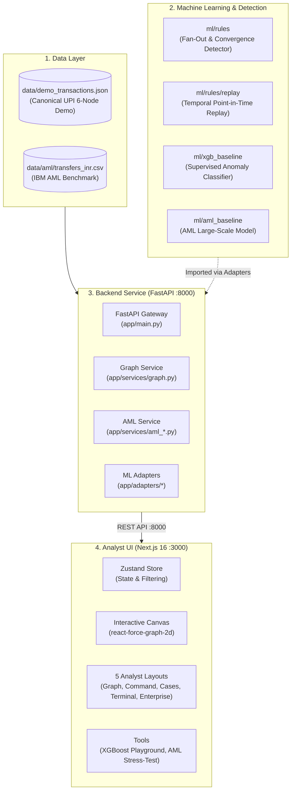
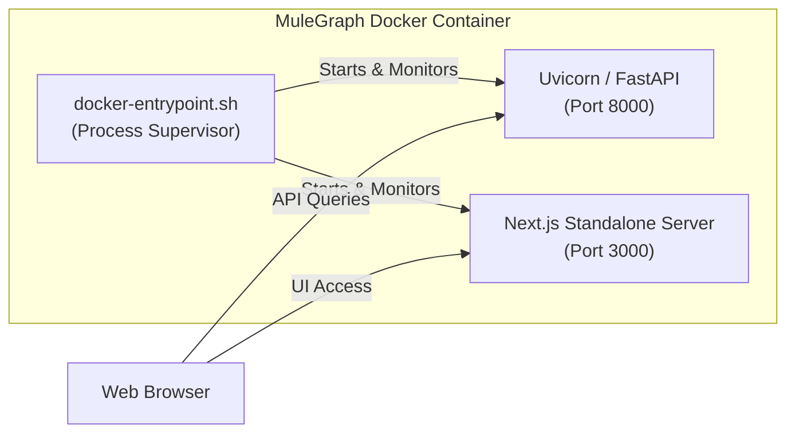

# MuleGraph — End-to-End System Playbook (A to Z)

> **Document Version:** 1.0.0  
> **Target Audience:** Software Engineers, ML Practitioners, Security Analysts, and Maintainers  
> **Scope:** Full repository overview — Data Layer, ML Detection Logic, FastAPI Backend, Next.js Frontend, Docker Containerization, and Operations.

---

## Table of Contents

1. [Executive Summary & Purpose](#1-executive-summary--purpose)
2. [High-Level Architecture](#2-high-level-architecture)
3. [The Core Demo Scenarios & Data Layer](#3-the-core-demo-scenarios--data-layer)
   - [Scenario A: Canonical UPI Mule Ring (6 Accounts, 7 Transfers)](#scenario-a-canonical-upi-mule-ring)
   - [Scenario B: IBM Synthetic AML Benchmark](#scenario-b-ibm-synthetic-aml-benchmark)
4. [Machine Learning & Detection Engines](#4-machine-learning--detection-engines)
   - [Deterministic Rules & Replay Engine (`ml/rules`)](#deterministic-rules--replay-engine)
   - [Standalone XGBoost Risk Model (`ml/xgb_baseline`)](#standalone-xgboost-risk-model)
   - [AML Baseline Model (`ml/aml_baseline`)](#aml-baseline-model)
5. [Backend Architecture & API Service (`backend/`)](#5-backend-architecture--api-service)
   - [Design Principles & The Adapter Pattern](#design-principles--the-adapter-pattern)
   - [Complete API Endpoint Catalog](#complete-api-endpoint-catalog)
6. [Frontend Architecture & User Experience (`frontend/`)](#6-frontend-architecture--user-experience)
   - [Technology Stack & Design System](#technology-stack--design-system)
   - [Interactive Force Graph Engine](#interactive-force-graph-engine)
   - [The Five Analyst Specialized Layouts](#the-five-analyst-specialized-layouts)
   - [Dedicated Investigation Tools](#dedicated-investigation-tools)
7. [Deployment & Containerization (Docker)](#7-deployment--containerization-docker)
   - [Unified Single-Container Architecture](#unified-single-container-architecture)
   - [Multi-Stage Dockerfile & Entrypoint Supervisor](#multi-stage-dockerfile--entrypoint-supervisor)
   - [Execution Cheat Sheet](#execution-cheat-sheet)
8. [Testing & Quality Assurance](#8-testing--quality-assurance)
9. [Ownership Boundaries & Codebase Directory Map](#9-ownership-boundaries--codebase-directory-map)

---

## 1. Executive Summary & Purpose

**MuleGraph** is an enterprise-grade financial crime intelligence platform designed to detect, analyze, and visualize **money mule networks** operating across real-time payment rails (such as UPI, IMPS, and SEPA).

### The Problem It Solves
Fraud rings and money-laundering syndicates use coordinated networks of compromised or collusive accounts ("mules") to rapidly disperse stolen funds. A typical pattern involves:
1. **Victim Ingress:** Funds stolen from a victim account (`ACC_VICTIM`) are transferred to an entry point (`ACC_A`).
2. **Layering / Fan-Out:** The entry mule immediately breaks down the large sum into smaller, velocity-intensive batches and sends them to multiple intermediary mule accounts (`ACC_B`, `ACC_C`, `ACC_D`).
3. **Integration / Convergence:** Intermediaries simultaneously funnel funds into a single exit/collector account (`ACC_X`) for rapid cash-out (ATM withdrawal, crypto purchase, or offshore wire).

Standard relational database queries fail to capture these multi-hop temporal relationships at scale. MuleGraph combines **deterministic graph pattern recognition**, **machine-learned risk scoring (XGBoost)**, and a **Next.js interactive 2D force-directed visual dashboard** to surface these rings in real time.

---

## 2. High-Level Architecture

The platform consists of four distinct layers operating in concert:



---

## 3. The Core Demo Scenarios & Data Layer

MuleGraph operates on two primary data foundations:

### Scenario A: Canonical UPI Mule Ring

Located at [`data/demo_transactions.json`](file:///d:/Mule_Graph/data/demo_transactions.json), this is the ground-truth deterministic benchmark for the entire project.

#### Topology & Flow:
```
[ACC_VICTIM] 
     │  (TX_001: ₹50,000)
     ▼
  [ACC_A]  ◄── Primary Mule (High Fan-Out)
     ├──────────────────┼──────────────────┐
     │ (TX_002: ₹15k)   │ (TX_003: ₹14k)   │ (TX_004: ₹16k)
     ▼                  ▼                  ▼
  [ACC_B]            [ACC_C]            [ACC_D]  ◄── Intermediary Layer
     │                  │                  │
     │ (TX_005: ₹13k)   │ (TX_006: ₹12k)   │ (TX_007: ₹14k)
     └──────────────────┼──────────────────┘
                        ▼
                     [ACC_X] ◄── Collector / Cash-Out Mule (High Convergence)
```

#### Detailed Transaction Audit Log:
| Transaction ID | Sender | Receiver | Amount (INR) | Timestamp (UTC) | Role in Chain |
|---|---|---|---|---|---|
| `TX_001` | `ACC_VICTIM` | `ACC_A` | ₹50,000 | 2026-01-01 10:00:00 | **Ingress:** Initial fraud loss from victim |
| `TX_002` | `ACC_A` | `ACC_B` | ₹15,000 | 2026-01-01 10:00:04 | **Fan-out:** Layering leg 1 (+4s) |
| `TX_003` | `ACC_A` | `ACC_C` | ₹14,000 | 2026-01-01 10:00:07 | **Fan-out:** Layering leg 2 (+7s) |
| `TX_004` | `ACC_A` | `ACC_D` | ₹16,000 | 2026-01-01 10:00:10 | **Fan-out:** Layering leg 3 (+10s) |
| `TX_005` | `ACC_B` | `ACC_X` | ₹13,000 | 2026-01-01 10:00:15 | **Convergence:** Extraction leg 1 (+15s) |
| `TX_006` | `ACC_C` | `ACC_X` | ₹12,000 | 2026-01-01 10:00:18 | **Convergence:** Extraction leg 2 (+18s) |
| `TX_007` | `ACC_D` | `ACC_X` | ₹14,000 | 2026-01-01 10:00:21 | **Convergence:** Extraction leg 3 (+21s) |

*Total execution window: **21 seconds** from victim loss to final collector convergence.*

### Scenario B: IBM Synthetic AML Benchmark

Located at `data/aml/transfers_inr.csv`, this dataset represents real-world enterprise banking scale:
- Thousands of accounts across multiple institutional clearing codes.
- Multiple payment formats (UPI, IMPS, RTGS, Wire).
- Time-series sliding windows for batch stress-testing and institutional compliance validation.

---

## 4. Machine Learning & Detection Engines

### Deterministic Rules & Replay Engine (`ml/rules`)

A pure-Python (zero third-party dependencies) deterministic pattern recognition engine.

#### 1. Fan-Out & Convergence Detection (`ml/rules/detector.py`)
- **Fan-Out Rule:** Identifies when an account sends money to $\ge 3$ distinct intermediaries within a configured time window (`fan_out_window_seconds = 60s`).
- **Convergence Rule:** Identifies when $\ge 3$ intermediaries forward received funds to one collector account within `convergence_window_seconds = 60s`.
- **Heuristic Scoring:** Findings are scored from `0.0` to `1.0` based on:
  1. Volume dispersion ratio (how much of the incoming money was rapidly sent out).
  2. Intermediary count ratio (number of active hops).
  3. Time compactness (how few seconds elapsed between the first fan-out and final convergence).

#### 2. Account Risk Aggregation (`ml/rules/account_risk.py`)
Maps graph patterns into structured account risk tiers:
- **`CRITICAL` (Score $\ge 0.8$):** High-velocity fan-out source (`ACC_A`) and primary collector (`ACC_X`).
- **`HIGH` (Score $\ge 0.6$):** Active intermediary mule hops (`ACC_B`, `ACC_C`, `ACC_D`).
- **`MEDIUM` / `LOW`:** Peripheral or slow-moving accounts.
- **`UNASSESSED`:** Accounts with zero detection evidence.

#### 3. Temporal Point-in-Time Replay (`ml/rules/replay.py`)
Allows an analyst to step through transactions second-by-second (`evaluate_at(t)`). It eliminates lookahead bias by ensuring only transactions timestamped $\le t$ are evaluated for that frame.

---

### Standalone XGBoost Risk Model (`ml/xgb_baseline`)

A supervised machine learning model for assessing transaction-level fraud probability.
- **Model Bundle:** `ml/models/xgb_baseline.joblib`
- **Features Extracted (`features.py`):**
  - Transaction amount and log-scaled amount.
  - Sender and receiver rolling frequency/velocity over 1h, 24h, 7d windows.
  - Ratio of amount to the account's historical average.
  - Time elapsed since the previous transaction.
- **Inference (`inference.py`):**
  - Configured with `tree_method="hist"` and `device="cpu"` to ensure sub-millisecond execution on standard hardware without requiring GPU/CUDA drivers.

---

### AML Baseline Model (`ml/aml_baseline`)

An XGBoost classifier tuned for heterogeneous enterprise banking payment streams, identifying layering and smurfing across diverse payment methods.

---

## 5. Backend Architecture & API Service (`backend/`)

Built with **FastAPI** (Python 3.14/3.12+), utilizing **Pydantic v2** for strict data validation and high-throughput serialization.

### Design Principles & The Adapter Pattern

```
backend/
├── app/
│   ├── api/          # Route controllers (health, graph, xgb_score, aml)
│   ├── services/     # Business logic, dataset ingestion, graph assembly
│   ├── adapters/     # ISOLATION BARRIER: Connects backend to ml/ directory
│   ├── schemas.py    # Request & Response Pydantic models
│   ├── config.py     # Environment configuration (.env loader)
│   └── main.py       # FastAPI application gateway & CORS middleware
```

**The Adapter Isolation Pattern (`backend/app/adapters/_ml_path.py`):**
To adhere to clean architectural boundaries, `ml/` is **never** copied into `backend/`. Instead, backend adapters explicitly mount the repository's `ml/` path at runtime:
- `adapters/ml_rules.py`: Wraps `ml/rules` for graph-level account risk scoring.
- `adapters/xgb_baseline.py`: Wraps `ml/xgb_baseline` for transaction-level scoring.
- `adapters/aml_baseline.py`: Wraps `ml/aml_baseline` for AML batch classification.

---

### Complete API Endpoint Catalog

| Method | Endpoint | Description | Request Body / Parameters | Response Model |
|---|---|---|---|---|
| `GET` | `/health` | System health & status check | None | `{"status": "ok"}` |
| `GET` | `/api/graph` | Canonical 6-node / 7-edge interactive graph with embedded rule scores | None | `GraphResponse` (nodes, edges, risk scores) |
| `POST` | `/api/xgb-score` | On-demand ML scoring for a raw transaction | JSON payload (sender, receiver, amount, timestamp) | `XgbScoreResponse` (score, risk_level, features) |
| `GET` | `/api/aml/summary` | Metadata, counts, and model status for AML dataset | None | `AmlDatasetSummaryResponse` |
| `GET` | `/api/aml/transactions` | Paginated listing of AML transactions | `limit`, `offset`, `account_id` | `AmlTransactionListResponse` |
| `POST` | `/api/aml/assess` | Run model + rule detection against AML records | List of AML transactions | `AmlAssessResponse` |
| `GET` | `/api/aml/graph` | Graph projection of the AML transfer network | Filter criteria | `AmlGraphResponse` |

---

## 6. Frontend Architecture & User Experience (`frontend/`)

Built using **Next.js 16 (App Router)**, **React 19**, **TypeScript**, and **Tailwind CSS v4**.

```
frontend/
├── app/
│   ├── page.tsx                  # Landing & Navigation Gateway
│   ├── layouts/
│   │   ├── graph/page.tsx        # 1. Fullscreen Interactive Graph View
│   │   ├── command/page.tsx      # 2. Command Center & Alerts View
│   │   ├── cases/page.tsx        # 3. Investigation Dossier View
│   │   ├── terminal/page.tsx     # 4. Dense Monospace Analyst Terminal
│   │   └── enterprise/page.tsx   # 5. Regulatory Compliance & Audit View
│   ├── tools/
│   │   └── xgb-score/page.tsx    # Live XGBoost Transaction Scoring Sandbox
│   └── aml/page.tsx              # Enterprise AML Benchmark Dashboard
├── components/                   # UI building blocks (shadcn + custom charts)
└── types/                        # TypeScript API contracts and graph models
```

### Interactive Force Graph Engine (`react-force-graph-2d`)
- **Physics Simulation:** Canvas-based 2D force simulation with dynamic link distance, charge repulsion, and center gravity.
- **Visual Encoding:**
  - **Node Color:** Red (`CRITICAL`), Amber (`HIGH`), Blue (`MEDIUM`), Green (`LOW`), Gray (`UNASSESSED`).
  - **Node Size:** Dynamically scaled by transaction degree and total monetary volume processed.
  - **Directional Particles:** Flowing particles along edges indicating the direction and velocity of fund movement.
- **Inspection Panel:** Clicking any node slides open a detailed profile showing:
  - Account ID, assigned label, and risk tier.
  - Ingress funds vs Egress funds (INR).
  - Chronological transaction audit list.

### The Five Analyst Specialized Layouts

1. **Interactive Graph Layout (`/layouts/graph`):** Canvas-dominant visual exploration layout designed for topological link analysis.
2. **Command Center (`/layouts/command`):** Real-time operations layout featuring alert feeds, aggregate volume metrics, and high-velocity risk cards.
3. **Cases Dossier (`/layouts/cases`):** Structured case file layout for compliance officers building a formal SAR (Suspicious Activity Report).
4. **Analyst Terminal (`/layouts/terminal`):** Monospace, keyboard-navigable tabular layout for high-density analysis.
5. **Enterprise Compliance (`/layouts/enterprise`):** Audit-ready reporting layout with distribution curves and risk categorization matrices.

---

## 7. Deployment & Containerization (Docker)

MuleGraph supports **unified production containerization** via Docker and Docker Compose.

### Unified Single-Container Architecture

Rather than requiring separate containers and networks for frontend and backend, the project provides an optimized **dual-process supervisor architecture**:



### Multi-Stage Dockerfile & Entrypoint Supervisor

The root [`Dockerfile`](file:///d:/Mule_Graph/Dockerfile) executes a two-stage build:
1. **Stage 1 (`frontend-builder`):** Uses `node:26-slim` to compile the Next.js frontend into an optimized standalone artifact (`output: "standalone"`).
2. **Stage 2 (`runtime`):** Uses `python:3.14-slim`, installs pinned Node.js binaries, installs Python ML/FastAPI dependencies, and copies the standalone frontend server.
3. **Supervisor (`docker-entrypoint.sh`):** Launches both `uvicorn` and `node /app/frontend/server.js`, continuously checks their process PIDs, and handles graceful shutdown (`SIGTERM`/`SIGINT`). If either process fails, the container restarts.

---

### Execution Cheat Sheet

#### 1. Run Everything in Docker (Recommended)
From the repository root (`d:\Mule_Graph`):
```powershell
# Build and run the entire unified project in background
docker compose up --build -d

# Check running status and health checks
docker compose ps

# View real-time combined logs
docker compose logs -f

# Stop the project
docker compose down
```
* Access the **Frontend UI**: [http://localhost:3000](http://localhost:3000)  
* Access the **Backend API Docs**: [http://localhost:8000/docs](http://localhost:8000/docs)  

#### 2. Run Locally Without Docker (Bare-Metal Development)

**Step A: Start the Backend (Terminal 1)**
```powershell
python -m venv backend/.venv
backend/.venv/Scripts/python.exe -m pip install -r backend/requirements-xgb.txt -r backend/requirements-dev.txt
backend/.venv/Scripts/python.exe -m uvicorn app.main:app --app-dir backend --host 127.0.0.1 --port 8000 --reload
```

**Step B: Start the Frontend (Terminal 2)**
```powershell
cd frontend
npm install
npm run dev
```

---

## 8. Testing & Quality Assurance

MuleGraph includes test suites at every tier:

```powershell
# 1. Validate canonical demo data consistency
python scripts/validate_demo.py

# 2. Run backend API test suite (21+ tests)
backend/.venv/Scripts/python.exe -m pytest backend/tests -q

# 3. Run ML rules engine test suite
python -m unittest discover -s ml/tests -t ml

# 4. Run ML XGBoost baseline test suite
ml/.venv/Scripts/python.exe -m unittest discover -s ml/xgb_baseline/tests -t ml

# 5. Run Frontend test suite
cd frontend
npm run test
```

---

## 9. Ownership Boundaries & Codebase Directory Map

### Ownership Matrix
- **Backend & Data Pipeline:** Smit Kapadia (`backend/`, `data/`)
- **Machine Learning & Detection:** Jatin Bisht (`ml/`)
- **Frontend & Visual Analytics:** Adnan Jukkerwala (`frontend/`)
- **Integration & Governance:** Ashmi Pandey (`docs/`, root contracts)

### Directory Map Cheat Sheet

```text
d:\Mule_Graph
├── compose.yaml                # Primary Docker Compose configuration
├── Dockerfile                  # Unified multi-stage container build
├── docker-entrypoint.sh        # Dual-process supervisor script
├── README.md                   # Repository introduction
├── PLAYBOOK.md                 # This definitive A-to-Z playbook
├── scripts/
│   └── validate_demo.py        # Validates demo data against contract
├── data/
│   ├── demo_transactions.json  # Ground-truth 6-account, 7-transfer demo data
│   ├── graph.example.json      # Reference precomputed graph payload
│   └── aml/transfers_inr.csv   # Large-scale AML transaction dataset
├── ml/
│   ├── rules/                  # Fan-out & convergence pattern detector
│   ├── xgb_baseline/           # XGBoost anomaly classifier & trainer
│   ├── aml_baseline/           # Scaled AML classification model
│   └── models/                 # Serialized model bundles (.joblib)
├── backend/
│   ├── app/                    # FastAPI application, routers, services
│   ├── tests/                  # Pytest unit & integration test suite
│   ├── requirements.txt        # Base FastAPI dependencies
│   └── requirements-xgb.txt    # Extended ML serving dependencies
├── frontend/
│   ├── app/                    # Next.js App Router pages & layouts
│   ├── components/             # Reusable UI components & force-graph
│   ├── types/                  # TypeScript interfaces & API models
│   └── package.json            # Node.js dependencies (React 19, Next 16)
└── docs/
    ├── api-contract.md         # Official REST API specification
    └── milestone-1.md          # Gate checklists and acceptance criteria
```

---
*End of Playbook. Maintained by the MuleGraph Project Team.*
