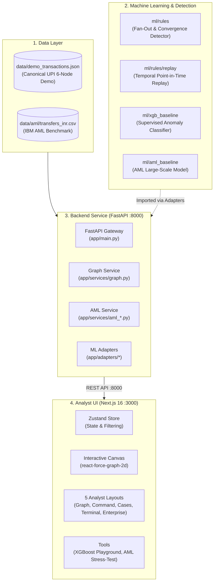
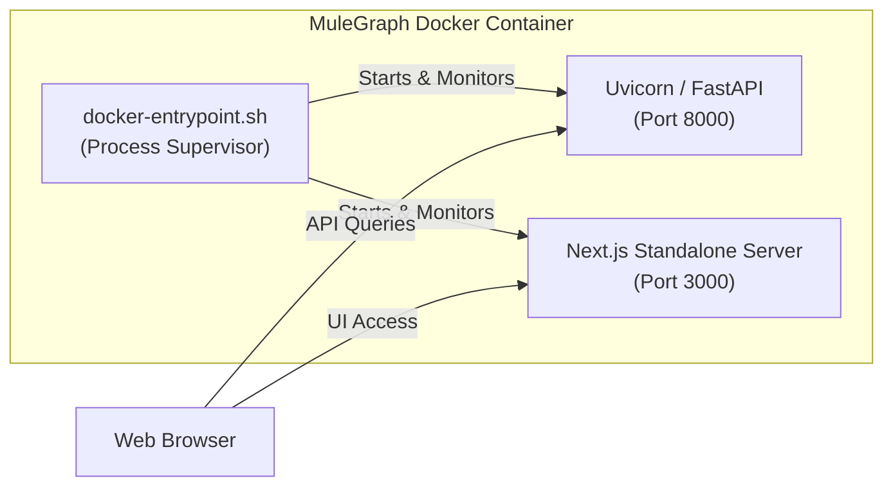

# MuleGraph — End-to-End System Playbook (A to Z)

> **Document Version:** 1.0.0  
> **Target Audience:** Software Engineers, ML Practitioners, Security Analysts, and Maintainers  
> **Scope:** Full repository overview — Data Layer, ML Detection Logic, FastAPI Backend, Next.js Frontend, Docker Containerization, and Operations.

---

## Table of Contents

1. [Executive Summary & Purpose](#1-executive-summary--purpose)
2. [High-Level Architecture](#2-high-level-architecture)
3. [The Core Demo Scenarios & Data Layer](#3-the-core-demo-scenarios--data-layer)
   - [Scenario A: Canonical UPI Mule Ring (6 Accounts, 7 Transfers)](#scenario-a-canonical-upi-mule-ring)
   - [Scenario B: IBM Synthetic AML Benchmark](#scenario-b-ibm-synthetic-aml-benchmark)
4. [Machine Learning & Detection Engines](#4-machine-learning--detection-engines)
   - [Deterministic Rules & Replay Engine (`ml/rules`)](#deterministic-rules--replay-engine)
   - [Standalone XGBoost Risk Model (`ml/xgb_baseline`)](#standalone-xgboost-risk-model)
   - [AML Baseline Model (`ml/aml_baseline`)](#aml-baseline-model)
   - [GraphSAGE Feasibility Assessment & Benchmark (`ml/experiments/graphsage`)](#graphsage-feasibility-assessment--benchmark-mlexperimentsgraphsage)
5. [Backend Architecture & API Service (`backend/`)](#5-backend-architecture--api-service)
   - [Design Principles & The Adapter Pattern](#design-principles--the-adapter-pattern)
   - [Complete API Endpoint Catalog](#complete-api-endpoint-catalog)
6. [Frontend Architecture & User Experience (`frontend/`)](#6-frontend-architecture--user-experience)
   - [Technology Stack & Design System](#technology-stack--design-system)
   - [Interactive Force Graph Engine](#interactive-force-graph-engine)
   - [The Five Analyst Specialized Layouts](#the-five-analyst-specialized-layouts)
   - [Dedicated Investigation Tools](#dedicated-investigation-tools)
7. [Deployment & Containerization (Docker)](#7-deployment--containerization-docker)
   - [Unified Single-Container Architecture](#unified-single-container-architecture)
   - [Multi-Stage Dockerfile & Entrypoint Supervisor](#multi-stage-dockerfile--entrypoint-supervisor)
   - [Execution Cheat Sheet](#execution-cheat-sheet)
8. [Testing & Quality Assurance](#8-testing--quality-assurance)
9. [Ownership Boundaries & Codebase Directory Map](#9-ownership-boundaries--codebase-directory-map)

---

## 1. Executive Summary & Purpose

**MuleGraph** is an enterprise-grade financial crime intelligence platform designed to detect, analyze, and visualize **money mule networks** operating across real-time payment rails (such as UPI, IMPS, and SEPA).

### The Problem It Solves
Fraud rings and money-laundering syndicates use coordinated networks of compromised or collusive accounts ("mules") to rapidly disperse stolen funds. A typical pattern involves:
1. **Victim Ingress:** Funds stolen from a victim account (`ACC_VICTIM`) are transferred to an entry point (`ACC_A`).
2. **Layering / Fan-Out:** The entry mule immediately breaks down the large sum into smaller, velocity-intensive batches and sends them to multiple intermediary mule accounts (`ACC_B`, `ACC_C`, `ACC_D`).
3. **Integration / Convergence:** Intermediaries simultaneously funnel funds into a single exit/collector account (`ACC_X`) for rapid cash-out (ATM withdrawal, crypto purchase, or offshore wire).

Standard relational database queries fail to capture these multi-hop temporal relationships at scale. MuleGraph combines **deterministic graph pattern recognition**, **machine-learned risk scoring (XGBoost)**, and a **Next.js interactive 2D force-directed visual dashboard** to surface these rings in real time.

---

## 2. High-Level Architecture

The platform consists of four distinct layers operating in concert:



---

## 3. The Core Demo Scenarios & Data Layer

MuleGraph operates on two primary data foundations:

### Scenario A: Canonical UPI Mule Ring

Located at [`data/demo_transactions.json`](file:///d:/Mule_Graph/data/demo_transactions.json), this is the ground-truth deterministic benchmark for the entire project.

#### Topology & Flow:
```
[ACC_VICTIM] 
     │  (TX_001: ₹50,000)
     ▼
  [ACC_A]  ◄── Primary Mule (High Fan-Out)
     ├──────────────────┼──────────────────┐
     │ (TX_002: ₹15k)   │ (TX_003: ₹14k)   │ (TX_004: ₹16k)
     ▼                  ▼                  ▼
  [ACC_B]            [ACC_C]            [ACC_D]  ◄── Intermediary Layer
     │                  │                  │
     │ (TX_005: ₹13k)   │ (TX_006: ₹12k)   │ (TX_007: ₹14k)
     └──────────────────┼──────────────────┘
                        ▼
                     [ACC_X] ◄── Collector / Cash-Out Mule (High Convergence)
```

#### Detailed Transaction Audit Log:
| Transaction ID | Sender | Receiver | Amount (INR) | Timestamp (UTC) | Role in Chain |
|---|---|---|---|---|---|
| `TX_001` | `ACC_VICTIM` | `ACC_A` | ₹50,000 | 2026-01-01 10:00:00 | **Ingress:** Initial fraud loss from victim |
| `TX_002` | `ACC_A` | `ACC_B` | ₹15,000 | 2026-01-01 10:00:04 | **Fan-out:** Layering leg 1 (+4s) |
| `TX_003` | `ACC_A` | `ACC_C` | ₹14,000 | 2026-01-01 10:00:07 | **Fan-out:** Layering leg 2 (+7s) |
| `TX_004` | `ACC_A` | `ACC_D` | ₹16,000 | 2026-01-01 10:00:10 | **Fan-out:** Layering leg 3 (+10s) |
| `TX_005` | `ACC_B` | `ACC_X` | ₹13,000 | 2026-01-01 10:00:15 | **Convergence:** Extraction leg 1 (+15s) |
| `TX_006` | `ACC_C` | `ACC_X` | ₹12,000 | 2026-01-01 10:00:18 | **Convergence:** Extraction leg 2 (+18s) |
| `TX_007` | `ACC_D` | `ACC_X` | ₹14,000 | 2026-01-01 10:00:21 | **Convergence:** Extraction leg 3 (+21s) |

*Total execution window: **21 seconds** from victim loss to final collector convergence.*

### Scenario B: IBM Synthetic AML Benchmark

Located at `data/aml/transfers_inr.csv`, this dataset represents real-world enterprise banking scale:
- Thousands of accounts across multiple institutional clearing codes.
- Multiple payment formats (UPI, IMPS, RTGS, Wire).
- Time-series sliding windows for batch stress-testing and institutional compliance validation.

---

## 4. Machine Learning & Detection Engines

### Deterministic Rules & Replay Engine (`ml/rules`)

A pure-Python (zero third-party dependencies) deterministic pattern recognition engine.

#### 1. Explainable Detection Patterns (`ml/rules`)

All pattern detectors output a unified `Finding` schema with quantitative `measured_signals`, concrete `evidence_transaction_ids`, `rule_version`, and a human-readable `explanation`. See [`docs/detection-patterns.md`](file:///d:/Mule_Graph/docs/detection-patterns.md) for full formal specifications and false-positive counterexamples.

1. **Fan-Out & Convergence (`ml/rules/detector.py`):**
   - **Pattern:** $S \rightarrow \ge 3$ intermediaries $\rightarrow$ common collector $C$.
   - **Time Window:** 60s (Demo) / 6 hours (AML).
   - **Signals:** `intermediary_ratio`, `amount_conservation`, `time_compactness`.

2. **Circular Transfer Loops (`ml/rules/circular.py`):**
   - **Pattern:** Directed cycle $A \rightarrow B \rightarrow \dots \rightarrow A$ returning funds to the originator.
   - **Typology:** Wash trading, artificial volume creation, round-tripping to obscure provenance.
   - **Criteria:** 2 to 5 hops, $\le 60$s hop delay, $\ge 70\%$ amount retention.
   - **Signals:** `cycle_length`, `cycle_path`, `retention_ratio`, `duration_seconds`, `hop_delays_seconds`.

3. **Rapid Forwarding Chains (`ml/rules/forwarding.py`):**
   - **Pattern:** Linear relay chain $A \rightarrow B \rightarrow C \rightarrow D$ without cycles.
   - **Typology:** Layering / peeling chains across institutions to evade detection before freezes.
   - **Criteria:** $\ge 3$ hops (4 accounts), $\le 60$s hop delay, $\ge 75\%$ pass-through at each hop.
   - **Signals:** `hops`, `chain_path`, `pass_through_ratio`, `duration_seconds`, `hop_delays_seconds`.

4. **Fan-In Collector Activity (`ml/rules/fan_in.py`):**
   - **Pattern:** Multiple distinct senders transferring into one collector within a tight window.
   - **Typology:** Micro-mule smurfing consolidation, phishing proceeds gathering.
   - **Criteria:** $\ge 3$ distinct senders, $\le 60$s window.
   - **Signals:** `sender_count`, `senders`, `total_amount`, `window_span_seconds`.
   - **Deduplication:** Redundant alerts are suppressed when already captured by a broader fan-out/convergence finding.

5. **Unusual Reactivation After Dormancy (`ml/rules/dormancy.py`):**
   - **Pattern:** Account idle for extended period experiencing an abrupt transaction burst.
   - **Typology:** Pre-aged "sleeper" mule accounts awakened for illicit operations.
   - **Criteria:** $\ge 3,600$s dormancy (Demo/test) / $\ge 30$ days (AML), burst window $\le 60$s, surge amount $\ge ₹10,000$ and $\ge 2\times$ historical average.
   - **Signals:** `inactivity_seconds`, `inactivity_days`, `burst_transaction_count`, `burst_total_amount`, `surge_ratio`.

#### 2. Multi-Pattern Orchestrator (`ml/rules/engine.py`)
- `RulesEngineConfig`: Timescale presets for second-resolution demo fixtures (`demo_preset()`) and hour/day-resolution enterprise AML datasets (`aml_preset()`).
- `detect_all_patterns(transactions, config)`: Runs enabled detectors with cross-rule alert deduplication.

#### 3. Account Risk Aggregation (`ml/rules/account_risk.py`)
Maps graph patterns into structured account risk tiers across all pattern types:
- Roles assigned: `"source"`, `"collector"`, `"intermediary"`, `"cycle_originator"`, `"cycle_intermediary"`, `"chain_originator"`, `"chain_recipient"`, `"chain_intermediary"`, `"fan_in_sender"`, `"dormant_account"`.
- Risk levels: `HIGH` (score ≥ 0.75), `MEDIUM` (0.4 ≤ score < 0.75), `LOW` (0 < score < 0.4), and `UNASSESSED` (no findings).

#### 4. Temporal Point-in-Time Replay (`ml/rules/replay.py`)
Allows an analyst to step through transactions second-by-second (`evaluate_at(t)` and `evaluate_all_at(t)`). It eliminates lookahead bias by ensuring only transactions timestamped $\le t$ are evaluated.


---

### Standalone XGBoost Risk Model (`ml/xgb_baseline`)

A supervised machine learning model for assessing transaction-level fraud probability.
- **Model Bundle:** `ml/models/xgb_baseline.joblib`
- **Features Extracted (`features.py`):**
  - Transaction amount and log-scaled amount.
  - Sender and receiver rolling frequency/velocity over 1h, 24h, 7d windows.
  - Ratio of amount to the account's historical average.
  - Time elapsed since the previous transaction.
- **Inference (`inference.py`):**
  - Configured with `tree_method="hist"` and `device="cpu"` to ensure sub-millisecond execution on standard hardware without requiring GPU/CUDA drivers.

---

### AML Baseline Model (`ml/aml_baseline`)

An XGBoost classifier tuned for heterogeneous enterprise banking payment streams, identifying layering and smurfing across diverse payment methods. Operates on 35 causal rolling velocity and counterparty features, achieving 0.2438 PR-AUC and 0.8446 ROC-AUC on the chronological test split.

---

### GraphSAGE Feasibility Assessment & Benchmark (`ml/experiments/graphsage`)

An empirical evaluation was conducted to assess whether deep Graph Neural Networks (GraphSAGE) are justified for MuleGraph's AML transfer classification. Full technical documentation is recorded in [`docs/ml/graphsage-evaluation.md`](file:///d:/Mule_Graph/docs/ml/graphsage-evaluation.md) and empirical results in [`ml/reports/graphsage_benchmark.json`](file:///d:/Mule_Graph/ml/reports/graphsage_benchmark.json).

#### Key Assessment Findings:
1. **Severe Label Scarcity:** The chronological test split contains only **18 positive laundering cases** across 5,479 transactions (0.33% base rate). A single transaction swings recall by 5.56%, making statistically significant proof of superiority impossible ($\text{SE} \approx \pm 10.2\%$).
2. **Causal Neighborhood Collapse:** Under strict temporal causality ($\mathcal{G}_{< t}$), **72.2% of test positives involve senders with zero prior transactions**, and **27.8% have zero prior transactions on both sides**. GraphSAGE's multi-hop aggregation collapses to isolated dummy node representations.
3. **Absence of Node Attributes:** The dataset provides zero account metadata (no KYC, age, balance). GNNs must rely entirely on structural statistics already captured more efficiently by XGBoost.
4. **Target Mismatch & Architectural Boundaries:** GraphSAGE natively learns node embeddings, whereas the dataset labels transactions and MuleGraph detects account rings. Core MuleGraph preserves its zero-graph-learning runtime invariant, and **no automatic fallback** is permitted between incompatible models.

#### Head-to-Head Empirical Benchmark Results:
| Metric / Budget | XGBoost Baseline | GraphSAGE GNN (Isolated) | Finding |
|---|---|---|---|
| **Test PR-AUC** | **0.2438** | **0.0568** | XGBoost achieves >4x higher PR-AUC |
| **Precision @ Validation Thresh** | **66.67%** (4 / 6) | **6.06%** (2 / 33) | GraphSAGE produces 15x more false alarms |
| **Recall @ Validation Thresh** | **22.22%** (4 / 18) | **11.11%** (2 / 18) | XGBoost catches twice as many positives |
| **Top-10 Review Budget Recall** | **27.78%** (TP=5) | **0.00%** (TP=0) | GNN catches zero alerts in Top-10 |
| **Top-20 Review Budget Recall** | **33.33%** (TP=6) | **5.56%** (TP=1) | XGBoost is 6x more effective |
| **Top-50 Review Budget Recall** | **44.44%** (TP=8) | **16.67%** (TP=3) | XGBoost catches nearly half of all laundering |
| **Batch Scoring Throughput** | **610,957 tx/s** | **7,250 tx/s** | XGBoost is 84x faster on batches |

**Conclusion:** Deploying GraphSAGE is **not operationally justified**. The existing XGBoost baseline remains the production standard. Prerequisites for future GNN consideration include: $\ge 1,000$ positive cases across distinct graph patterns, dense historical transaction histories (median degree $\ge 10$), static account KYC attributes, and audited account-level ground truth.


## 5. Backend Architecture & API Service (`backend/`)

Built with **FastAPI** (Python 3.14/3.12+), utilizing **Pydantic v2** for strict data validation and high-throughput serialization.

### Design Principles & The Adapter Pattern

```
backend/
├── app/
│   ├── api/          # Route controllers (health, graph, xgb_score, aml)
│   ├── services/     # Business logic, dataset ingestion, graph assembly
│   ├── adapters/     # ISOLATION BARRIER: Connects backend to ml/ directory
│   ├── schemas.py    # Request & Response Pydantic models
│   ├── config.py     # Environment configuration (.env loader)
│   └── main.py       # FastAPI application gateway & CORS middleware
```

**The Adapter Isolation Pattern (`backend/app/adapters/_ml_path.py`):**
To adhere to clean architectural boundaries, `ml/` is **never** copied into `backend/`. Instead, backend adapters explicitly mount the repository's `ml/` path at runtime:
- `adapters/ml_rules.py`: Wraps `ml/rules` for graph-level account risk scoring.
- `adapters/xgb_baseline.py`: Wraps `ml/xgb_baseline` for transaction-level scoring.
- `adapters/aml_baseline.py`: Wraps `ml/aml_baseline` for AML batch classification.

---

### Complete API Endpoint Catalog

| Method | Endpoint | Description | Request Body / Parameters | Response Model |
|---|---|---|---|---|
| `GET` | `/health` | Liveness health check | None | `{"status": "ok"}` |
| `GET` | `/health/ready` | Dependency readiness probe (demo data, AML data, ML rules, models, event bus) | None | `ReadinessResponse` (200 ready / 503 degraded) |
| `GET` | `/api/events` | Server-Sent Events (SSE) live updates stream with `Last-Event-ID` resume | `workspace_id`, `since_id`, `Last-Event-ID` | `text/event-stream` (`transaction_committed`, `assessment_completed`, `case_updated`, `resync`) |
| `GET` | `/api/events/poll` | HTTP polling fallback for event streams | `since_id`, `workspace_id` | `{"events": [...], "resync_required": bool, "latest_event_id": int}` |
| `GET` | `/api/cases` | List investigation cases | None | List of `CaseResponse` |
| `POST` | `/api/cases/{case_id}/status` | Transition case status and append notes (emits live `case_updated` event) | `{"status": "...", "author": "...", "note": "..."}` | `CaseResponse` |
| `GET` | `/api/operations/metrics` | Structured operational measurements (request latency p50/p95/p99, analysis duration, ingestion failures, event lag) | None | Operational metrics JSON |
| `GET` | `/api/graph` | Canonical 6-node / 7-edge interactive graph with embedded rule scores and real findings | None | `GraphResponse` (nodes, edges, findings) |
| `POST` | `/api/assess` | **Stateless** re-evaluation of a caller-supplied canonical-demo transaction set against `ml/rules` (whole-rupee `amount`) | `{"transactions": [{id, sender, receiver, amount, timestamp}]}` | Account risk + real network findings |
| `POST` | `/api/xgb-score` | On-demand card-fraud scoring in the model's own native schema (unrelated to mule-network risk) — `503` if the optional model/deps aren't installed | `{time, amount, v[28]}` | `XgbScoreResponse` (score, is_fraud, threshold) |
| `GET` | `/api/aml/summary` | Metadata, counts, and model availability for the IBM AML dataset — `500` with a clear message if the dataset file isn't present | None | `AmlDatasetSummaryResponse` |
| `GET` | `/api/aml/transactions` | Paginated listing of AML transactions | `cursor`, `limit`, `account`, `after`, `before` | `AmlTransactionListResponse` |
| `GET` | `/api/aml/graph` | Bounded BFS graph projection of the AML transfer network, with `ml/rules` findings at a dataset-appropriate (hours) timescale | `account`, `max_nodes`, `max_edges` | `AmlGraphResponse` |
| `POST` | `/api/aml/assess` | **Stateless** transaction-level scoring via `ml/aml_baseline` (integer `amount_paise`, never merged with `/api/graph`'s account/network risk) — `503` if the trained model isn't present | `{"transactions": [...]}` (AML schema) | `AmlAssessResponse` |
| `POST` | `/api/aml/session/transactions` | Commits transactions to this process's in-memory session (emits live `transaction_committed` event) | `{"transactions": [...]}` (AML schema) | `AmlSessionCommitResponse` |

Optional-artifact endpoints (`/api/xgb-score`, `/api/aml/*`) never train or
download anything at request time or at startup — a missing model/dataset
file is always reported as a specific, actionable error, never a silent
fallback or a crash. See `backend/docs/integration-contract.md` and
`backend/docs/aml-integration-contract.md` for full contracts, and
`ml/models/README.md` / `data/aml/README.md` for how to supply the
artifacts each optional endpoint needs.

---

## 6. Frontend Architecture & User Experience (`frontend/`)

Built using **Next.js 16 (App Router)**, **React 19**, **TypeScript**, and **Tailwind CSS v4**.

```
frontend/
├── app/
│   ├── page.tsx                  # Landing & Navigation Gateway
│   ├── layouts/
│   │   ├── graph/page.tsx        # 1. Fullscreen Interactive Graph View
│   │   ├── command/page.tsx      # 2. Command Center & Alerts View
│   │   ├── cases/page.tsx        # 3. Investigation Dossier View
│   │   ├── terminal/page.tsx     # 4. Dense Monospace Analyst Terminal
│   │   └── enterprise/page.tsx   # 5. Regulatory Compliance & Audit View
│   ├── tools/
│   │   └── xgb-score/page.tsx    # Live XGBoost Transaction Scoring Sandbox
│   └── aml/page.tsx              # Enterprise AML Benchmark Dashboard
├── components/                   # UI building blocks (shadcn + custom charts)
└── types/                        # TypeScript API contracts and graph models
```

### Interactive Force Graph Engine (`react-force-graph-2d`)
- **Physics Simulation:** Canvas-based 2D force simulation with dynamic link distance, charge repulsion, and center gravity.
- **Visual Encoding:**
  - **Node Color:** Red (`CRITICAL`), Amber (`HIGH`), Blue (`MEDIUM`), Green (`LOW`), Gray (`UNASSESSED`).
  - **Node Size:** Dynamically scaled by transaction degree and total monetary volume processed.
  - **Directional Particles:** Flowing particles along edges indicating the direction and velocity of fund movement.
- **Inspection Panel:** Clicking any node slides open a detailed profile showing:
  - Account ID, assigned label, and risk tier.
  - Ingress funds vs Egress funds (INR).
  - Chronological transaction audit list.

### The Five Analyst Specialized Layouts

1. **Interactive Graph Layout (`/layouts/graph`):** Canvas-dominant visual exploration layout designed for topological link analysis.
2. **Command Center (`/layouts/command`):** Real-time operations layout featuring alert feeds, aggregate volume metrics, and high-velocity risk cards.
3. **Cases Dossier (`/layouts/cases`):** Structured case file layout for compliance officers building a formal SAR (Suspicious Activity Report).
4. **Analyst Terminal (`/layouts/terminal`):** Monospace, keyboard-navigable tabular layout for high-density analysis.
5. **Enterprise Compliance (`/layouts/enterprise`):** Audit-ready reporting layout with distribution curves and risk categorization matrices.

---

## 7. Deployment & Containerization (Docker)

MuleGraph supports **unified production containerization** via Docker and Docker Compose.

### Unified Single-Container Architecture

Rather than requiring separate containers and networks for frontend and backend, the project provides an optimized **dual-process supervisor architecture**:



### Multi-Stage Dockerfile & Entrypoint Supervisor

The root [`Dockerfile`](file:///d:/Mule_Graph/Dockerfile) executes a two-stage build:
1. **Stage 1 (`frontend-builder`):** Uses `node:26-slim` to compile the Next.js frontend into an optimized standalone artifact (`output: "standalone"`).
2. **Stage 2 (`runtime`):** Uses `python:3.14-slim`, installs pinned Node.js binaries, installs Python ML/FastAPI dependencies, and copies the standalone frontend server.
3. **Supervisor (`docker-entrypoint.sh`):** Launches both `uvicorn` and `node /app/frontend/server.js`, continuously checks their process PIDs, and handles graceful shutdown (`SIGTERM`/`SIGINT`). If either process fails, the container restarts.

**Builds from a fresh checkout with zero optional artifacts present.** The
two large, gitignored, optional inputs (`data/aml/transfers_inr.csv`,
`ml/models/{xgb_baseline,aml_baseline}.joblib`) are copied
**directory-level**, not as specific-file `COPY`s — `COPY data/aml/ ./data/aml/`
and `COPY ml/models/ ./ml/models/` both succeed whether or not the optional
file inside is actually present (a specific-file `COPY` would hard-fail the
whole build the instant the file is missing). `ml/models/README.md` is
tracked specifically so the `ml/models/` directory exists at all on a fresh
`git clone` (git doesn't track empty directories). Verified 2026-09-09 by
building with both artifacts moved aside, then confirming `/api/graph` and
`POST /api/assess` work fully while `/api/xgb-score` and `/api/aml/*` return
a clear, specific error — see root `README.md`.

Before the two supervised processes start, `docker-entrypoint.sh` checks for
the two AML artifacts and logs their status either way. `AML_MODE`
(env var, default `optional`) controls what happens if they're missing:
`optional` logs and continues (the lightweight demo config); `required`
refuses to start the container at all, printing exactly what's missing (the
explicit AML config) — see root `README.md` and `compose.yaml`. Neither mode
ever downloads or trains anything itself.

---

### Execution Cheat Sheet

#### 1. Run Everything in Docker (Recommended)
From the repository root (`d:\Mule_Graph`):
```powershell
# Build and run the entire unified project in background
docker compose up --build -d

# Check running status and health checks
docker compose ps

# View real-time combined logs
docker compose logs -f

# Stop the project
docker compose down
```
* Access the **Frontend UI**: [http://localhost:3000](http://localhost:3000)  
* Access the **Backend API Docs**: [http://localhost:8000/docs](http://localhost:8000/docs)  

#### 2. Run Locally Without Docker (Bare-Metal Development)

**Step A: Start the Backend (Terminal 1)**
```powershell
python -m venv backend/.venv
backend/.venv/Scripts/python.exe -m pip install -r backend/requirements-xgb.txt -r backend/requirements-dev.txt
backend/.venv/Scripts/python.exe -m uvicorn app.main:app --app-dir backend --host 127.0.0.1 --port 8000 --reload
```

**Step B: Start the Frontend (Terminal 2)**
```powershell
cd frontend
npm install
npm run dev
```

---

## 8. Testing & Quality Assurance

MuleGraph includes test suites at every tier. Counts below are as verified
2026-09-09; artifact-dependent suites (marked) self-skip with a clear reason
when their optional dataset/model isn't present, rather than failing or
silently passing nothing.

```powershell
# 1. Validate canonical demo data consistency
python scripts/validate_demo.py

# 2. Run backend API test suite (114 tests)
backend/.venv/Scripts/python.exe -m pytest backend/tests -q

# 3. Run ML rules engine test suite (29 tests, stdlib only)
python -m unittest discover -s ml/tests -t ml

# 4. Run ML XGBoost baseline test suite (20 tests; artifact-dependent)
ml/.venv/Scripts/python.exe -m unittest discover -s ml/xgb_baseline/tests -t ml

# 5. Run ML AML baseline test suite (29 tests; artifact-dependent)
ml/.venv/Scripts/python.exe -m unittest discover -s ml/aml_baseline/tests -t ml

# 6. Run the AML dataset-prep script's own tests (19 tests; parity-checks
#    against the real committed ml/data/aml/splits/*.csv, artifact-dependent)
ml/.venv/Scripts/python.exe -m unittest scripts.test_prepare_aml_dataset -v

# 7. Frontend: unit tests, type-check, lint, production build
cd frontend
npm test
npx tsc --noEmit
npm run lint
npm run build

# 8. Browser integration tests (Playwright) -- spins up its own isolated
#    backend + frontend on dedicated ports, never a shared personal server
cd frontend
npx playwright test
```

`.github/workflows/ci.yml` runs all of the above on every push/PR, split
into lightweight jobs (always run, must pass) and artifact-dependent ML
jobs (install the full dependency stack, but self-report skips via each
suite's own guards when the actual data/model files aren't present).

---

## 9. Ownership Boundaries & Codebase Directory Map

### Ownership Matrix
- **Backend & Data Pipeline:** Smit Kapadia (`backend/`, `data/`)
- **Machine Learning & Detection:** Jatin Bisht (`ml/`)
- **Frontend & Visual Analytics:** Adnan Jukkerwala (`frontend/`)
- **Integration & Governance:** Ashmi Pandey (`docs/`, root contracts)

### Directory Map Cheat Sheet

```text
d:\Mule_Graph
├── .github/workflows/ci.yml    # CI: fixture validation, all test suites, lint/build, e2e
├── compose.yaml                # Primary Docker Compose configuration
├── Dockerfile                  # Unified multi-stage container build (artifact-optional)
├── docker-entrypoint.sh        # Dual-process supervisor + AML_MODE prerequisite check
├── README.md                   # Repository introduction & quickstart
├── PLAYBOOK.md                 # This definitive A-to-Z playbook
├── scripts/
│   ├── validate_demo.py        # Validates demo data against contract
│   ├── prepare_aml_dataset.py  # Tracked IBM AML source -> data/aml/ + ml/data/aml/splits/ converter
│   └── test_prepare_aml_dataset.py  # Its tests, incl. parity vs. real committed features
├── data/
│   ├── demo_transactions.json  # Ground-truth 6-account, 7-transfer demo data
│   ├── graph.example.json      # Reference precomputed graph payload
│   └── aml/                    # IBM AML dataset (gitignored bulk files; README.md tracked)
├── ml/
│   ├── rules/                  # Fan-out & convergence pattern detector
│   ├── xgb_baseline/           # XGBoost anomaly classifier & trainer
│   ├── aml_baseline/           # AML transaction classifier
│   └── models/                 # Serialized model bundles (.joblib, gitignored) + README.md (versions/checksums)
├── backend/
│   ├── app/                    # FastAPI application, routers, services
│   ├── tests/                  # Pytest unit & integration test suite
│   ├── requirements.txt        # Base FastAPI dependencies
│   └── requirements-xgb.txt    # Extended ML serving dependencies
├── frontend/
│   ├── app/                    # Next.js App Router pages & layouts
│   ├── components/             # Reusable UI components & force-graph
│   ├── types/                  # TypeScript interfaces & API models
│   ├── e2e/                    # Playwright browser integration tests
│   ├── playwright.config.ts    # Isolated-server e2e config
│   └── package.json            # Node.js dependencies (React 19, Next 16)
└── docs/
    ├── api-contract.md         # Official REST API specification
    └── milestone-1.md          # Gate checklists and acceptance criteria
```

---
*End of Playbook. Maintained by the MuleGraph Project Team.*
